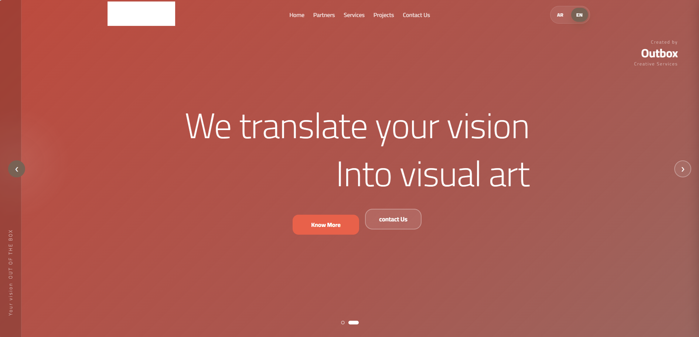
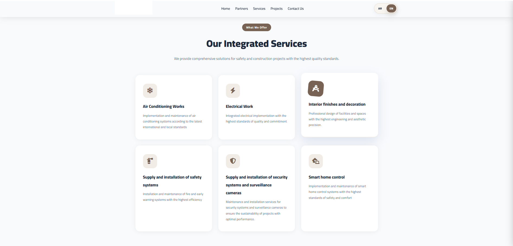
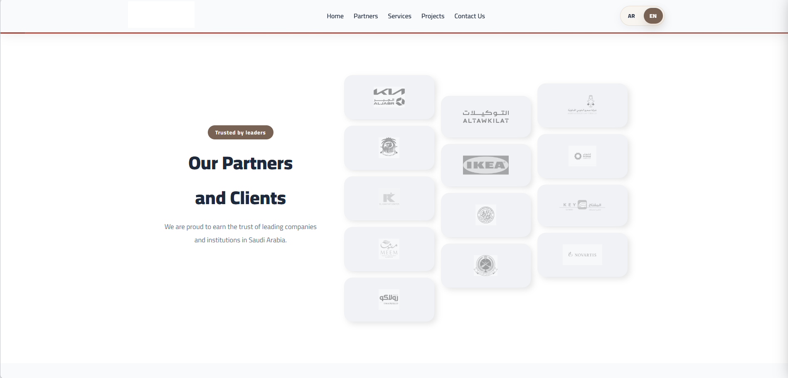
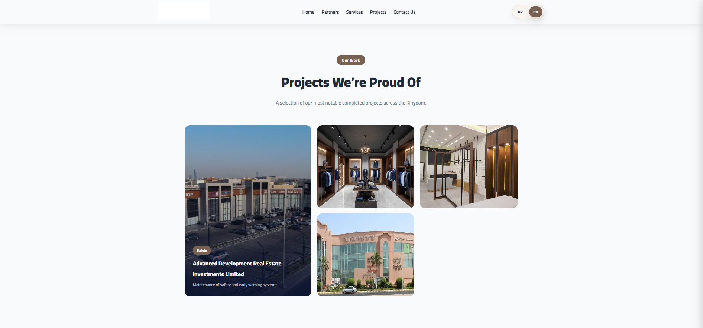
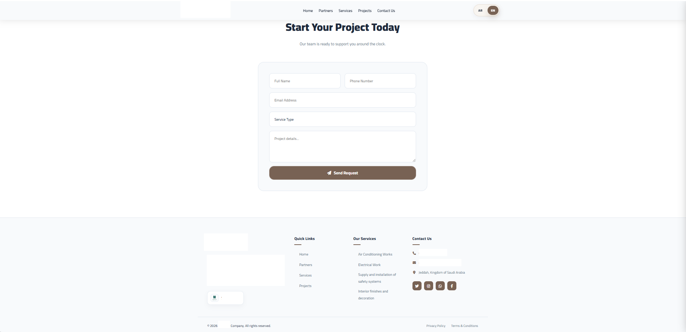
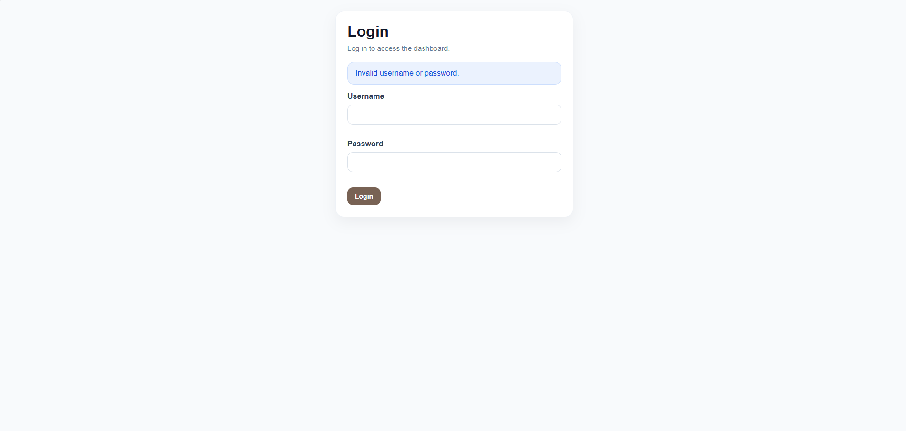
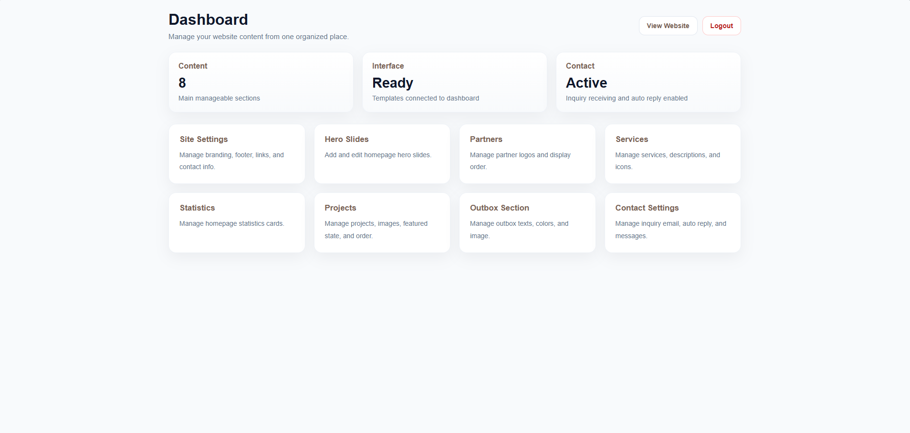
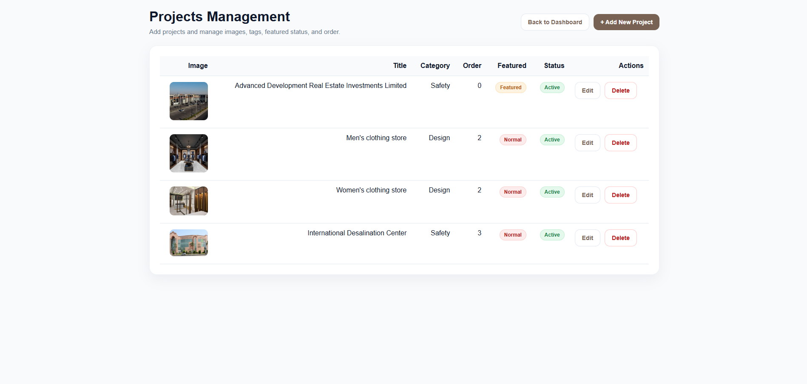

# Bilingual Corporate Website & Admin Dashboard Case Study

## Overview
This project is a case study for a bilingual corporate website supported by an admin dashboard for structured content management.

## Project Type
Corporate website with admin-side content management

## My Role
- Frontend interface design and implementation
- Public website layout structuring
- Bilingual page flow planning
- Admin dashboard interface organization
- Project and content management screen design

## Scope
This project was not limited to a public-facing landing page.
It included both a bilingual corporate website and an internal admin-side workflow for managing key sections such as projects, services, and interface content.

## Public Website Sections
- Home page
- Services section
- Partners / clients section
- Statistics / counters section
- Contact section

## Admin-Side Sections
- Admin login
- Main dashboard
- Site settings
- Hero slides management
- Partners management
- Project management
- Services management
- Counter management
- Outbox management
- Contact settings

## Tools & Technologies
- HTML
- CSS / SCSS
- Jinja
- JavaScript
- Python
- SQLite
- Bilingual interface planning
- Admin UI structure
- Content-oriented frontend implementation

## Key Features
- Bilingual public-facing interface
- Structured corporate content presentation
- Services and partner showcase sections
- Contact and inquiry section
- Statistics/counter presentation
- Internal dashboard for content management
- Project management interface for admin use

## Screenshots

### Home Page

### Services Page

### Partners Section

### Statistics Section

### Projects Section

### Contact Page

### Admin Login

### Admin Dashboard

### Admin Projects Page

## Privacy Note
The source code is intentionally not included in this repository.
This case study is shared to present the project structure, interface design approach, bilingual website flow, and admin-side workflow without exposing private client code or sensitive implementation details.
